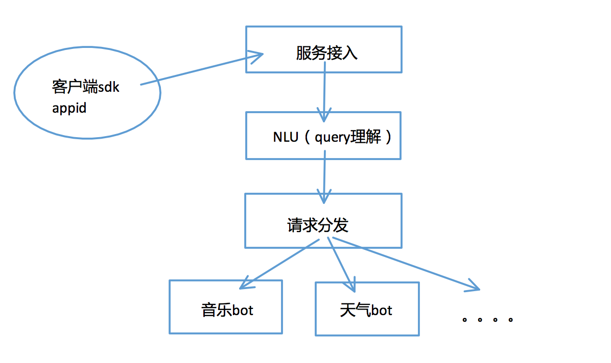
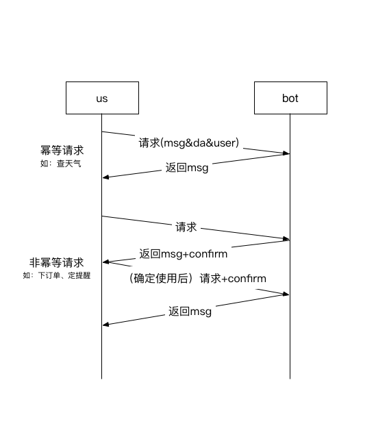

# 度秘开放平台-BotApi接口说明

目的：
  * 为了让能够让度秘内部的rd开发下游bot
  * 为了给未来的bot开放平台做准备

整理度秘系统和bot之间的接口


## 整体格式说明

### 架构描述



这篇文档整理的是下游bot的输入输出接口


## 交互模式说明（confirm）



  * 之所以有confirm请求，是因为us会把同一个请求发给多个bot，然后挑选较好的一个。bot返回的结果，有可能不被使用
  * 按bot对请求的处理有无副作用，分为幂等请求和非幂等请求
  * 幂等请求如：
    * 通用信息
    * 天气
  * 非幂等请求如：
    * 提醒（bot会为用户创建提醒）
    * 打车（bot会帮用户叫车）

### 请求格式

以下是现有的协议

```javascript
{
  "user_id": "3101", ///用户id，如果非登录用户会改成
  "query": "张岩", //原始query
  "version": 1, //版本号
  "msg": {   ///老的协议格式，原始的msg，不知为何result_content是个字符串
    "id": "1454319650_5906bphzi",
    "debug": 1,
    "mode": 0,
    "operation_system": "ios",
    "app_ver": "1.4.0",
    "from": "ios",
    "ctime": 1454319650,
    "type": "user",
    "query_type": "1",
    "result_list": [
      {
        "result_confidence": 100,
        "result_content": "{\"answer\":\"张岩\"}\n",
        "result_type": "txt",
        "source_type": ""
      }
    ],
    "request_uid": "1463803763",
    "client_msg_id": "20674",
    "request_from": "0",
    "request_type": "0",
    "sample_name": "bear_brain_wireless"
  },
  "log_id": "5969bdd5126d493387a6b127d8c45ce7", //串起整个请求的id
  "request_type": "dumi", //现在的策略分支
  "params": {
    "loc": "%7B%22crd%22%3A%2212944500.486221_4845580.669330_200%22%2C%22city%22%3A%22%5Cu5317%5Cu4eac%5Cu5e02%22%2C%22addr%22%3A%22%5Cu5317%5Cu4eac%5Cu5e02%5Cu6d77%5Cu6dc0%5Cu533a%5Cu8f6f%5Cu4ef6%5Cu56ed%5Cu897f%5Cu4e09%5Cu8def%22%7D",//其实是地址信息，但有了location之后这个已经没用了
    "cip": "1.2.2.1",//客户端ip
    "bear_params": {
      "nlu_response": "{\"analysis\":{},\"parsed_text\":\"张 岩\",\"raw_text\":\"张岩\",\"results\":[{\"demand\":0,\"domain\":\"universal_search\",\"intent\":\"search\",\"object\":{},\"pushleft_switch\":\"0\",\"score\":1,\"str_result_content\":{},\"str_result_type\":\"\"}],\"sugs\":\"张岩\",\"sugs_types\":\"PAT_EC\"}\n"
    },
    "client_from": "NA",
    "intervene_from": "na",
    "sc_response": "{}"
  },
  //完整的地址信息
  "location": {
    "la": 40.0433,
    "lo": 116.269,
    "bd_la": 40.0508,
    "bd_lo": 116.281,
    "mi_la": 4845580,
    "mi_lo": 12944500,
    "address": "北京市海淀区软件园西三路",
    "city": "北京市",
    "city_code": 131,
    "country": "中国",
    "country_code": 0,
    "direction": "",
    "distance": "",
    "district": "海淀区",
    "province": "北京市",
    "street": "软件园西三路",
    "street_number": "",
    "cip": "1.2.2.1",
    "cip_type": "mockbycity",
    "location_type": "real",
    "sematic_description": "百度科技园内"
  },
  "page_cnt": 10,
  "page_num": 1,
  //没有多轮就可以忽略session字段
  "sessions": [
    {
      "action": "get",
      "type": "string",
      "name": "phone",
      "key": "3101",
      "list_sessions": [],
      "list_sessions_str": [
        "{\"SendSMS\":{\"intent\":\"SendSMS\",\"score\":42,\"objects\":[{\"key\":\"MSMOmit\",\"value\":\"\\u8bf4\",\"score\":1},{\"key\":\"_MSMOmit\",\"value\":\"\\u8bf4\",\"score\":1},{\"key\":\"MSGBody\",\"value\":\"\\u4e0d\\u56de\\u5bb6\\u5403\\u996d\",\"score\":1},{\"key\":\"_MSGBody\",\"value\":\"\\u4e0d\\u56de\\u5bb6\\u5403\\u996d\",\"score\":1},{\"key\":\"SendKey\",\"value\":\"\\u53d1\",\"score\":1},{\"key\":\"_SendKey\",\"value\":\"\\u53d1\",\"score\":1},{\"key\":\"WantKey\",\"value\":\"\\u6211\\u8981\",\"score\":1},{\"key\":\"_WantKey\",\"value\":\"\\u6211\\u8981\",\"score\":1}]}}"
      ],
      "hash_sessions": []
    }
  ],
  //如果是百度登录用户的话，会有信息
  "user_info": {
    "user_id": "",
    "extra": []
  },
  "data": {
    "status": 0,
    "msg": "OK",
    "da_query_info": [  //现在的qu结果，数组，type是服务（第二级的type是domain，第三级result_list里的type是intent）
      {
        "query": "张岩",
        "type": "qu",
        "result_list": [
          {
            "type": "query",
            "score": 0,
            "result_list": []
          },
          {
            "type": "session",
            "score": 0,
            "result_list": []
          }
        ]
      }
    ],
    "params": [ //其他几个qu结果的原始数据，一般情况都不用看
      {
        "key": "nlu_responce",
        "value": "{\"analysis\":{},\"parsed_text\":\"张 岩\",\"raw_text\":\"张岩\",\"results\":[{\"demand\":0,\"domain\":\"universal_search\",\"intent\":\"search\",\"object\":{},\"pushleft_switch\":\"0\",\"score\":1,\"str_result_content\":{},\"str_result_type\":\"\"}],\"sugs\":\"张岩\",\"sugs_types\":\"PAT_EC\"}\n"
      },
      {
        "key": "qu_responce",
        "value": "{\"err_no\":0, \"result\":[{\"normal\":{}, \"qu\":{\"query_voice\":{\"res\":[{\"domain\":\"phone\", \"intent\":\"F->Phone->Context\", \"score\":1, \"objects\":[{\"key\":\"CallTarget\", \"value\":\"张岩\", \"score\":1}, {\"key\":\"_CallTarget\", \"value\":\"张岩\", \"score\":1}], \"reduce_tree_info\":\"(query(F->Phone->Context(CallTarget(Person 张岩))))\"}, {\"domain\":\"UNDEFINED\", \"intent\":\"F->alarmlocation\", \"score\":5502, \"objects\":[{\"key\":\"Route\", \"value\":\"张岩\", \"score\":1}, {\"key\":\"_Route\", \"value\":\"张岩\", \"score\":1}], \"reduce_tree_info\":\"(query(F->alarmlocation(Route(F->route(Arrival(F->arrival(ARRIVAL(VILLAGE 张岩))))))))\"}, {\"domain\":\"UNDEFINED\", \"intent\":\"F->alarmlocation\", \"score\":5503, \"objects\":[{\"key\":\"Route\", \"value\":\"张岩\", \"score\":1}, {\"key\":\"_Route\", \"value\":\"张岩\", \"score\":1}], \"reduce_tree_info\":\"(query(F->alarmlocation(Route(F->route(Arrival(F->arrival(ARRIVAL(POI(VILLAGE 张岩)))))))))\"}]}}, \"queryId\":1}]}"
      }
    ]
  }
}


```

### 正常返回格式


```javascript

{
  "status": 0,
  "msg": "ok",
  "data": {
    "result_list": [
      {
        //置信度和槽位置信度，都可以不传
        "confidence": 300,
        "form_confidence": 0,
        //bot的id，必须有
        "source_type": "phone",
        //统计字段，可以用来给bot的返回值分类，可以不传
        "source_sub_type": "contact",
        //真正拼的消息其实是这个content字段，现在对外返回的resource、directives等字段都放在这个里面，和result_list平级，下一段详细讲这个content
        "content": "{\"result_list\":[{\"result_content\":{\"answer\":\"<SYSTEM-NAME>为你查看联系人“张岩”\"},\"result_type\":\"txt\",\"source_type\":\"phone\",\"source_sub_type\":\"contact\",\"voice\":\"<SYSTEM-NAME>为你查看联系人“张岩”\"}],\"type\":\"server\",\"generator\":\"phone_function\",\"user_id\":\"3101\"}",
        //会用于us排序的字段，为了让排序策略起作用，尽可能传一下
        "stategy_middle_data": {
          "raw_answer": [
            {
              "title": "",
              "subtitle": "",
              "answer": "<SYSTEM-NAME>为你查看联系人“张岩”",
              "url": ""
            }
          ]
        }
      }
    ],
    //页码，总页数，总结果数，都可以不传
    "page_num": 1,
    "page_cnt": 1,
    "result_num": 1,
    ////和请求中的da_query_info格式一致，表示下游bot实际使用的da_query_info（也可以说就是把请求中不使用的），可以为空
    "service_query_info": [
      {
        "query": "张岩",
        "type": "phone",
        "result_list": [
          {
            "type": "phone",
            "score": 100,
            "result_list": [
              {
                "type": "contact",
                "score": 0,
                "content": "",
                "result_list": [
                  {
                    "key": "name_for_view",
                    "type": "text",
                    "score": 0,
                    "value": [
                      {
                        "name": "name_for_view",
                        "value": "张岩"
                      }
                    ]
                  },
                  {
                    "key": "pinyin_for_view",
                    "type": "text",
                    "score": 0,
                    "value": [
                      {
                        "name": "pinyin_for_view",
                        "value": "zhang+yan"
                      }
                    ]
                  },
                  {
                    "key": "action_type",
                    "type": "text",
                    "score": 0,
                    "value": [
                      {
                        "name": "action_type",
                        "value": "1"
                      }
                    ]
                  },
                  {
                    "key": "show_query",
                    "type": "text",
                    "score": 0,
                    "value": [
                      {
                        "name": "show_query",
                        "value": "张岩"
                      }
                    ]
                  }
                ]
              }
            ]
          }
        ]
      }
    ],
    "server_query_intent": "\"\""
  },
  /////如果不是多轮，此字段可没有
  "sessions": [
    {
      "status": 0,
      "msg": "ok",
      "action": "set",
      "type": "string",
      "name": "phone",
      "key": "3101",
      "list_sessions_str": [
        "{\"empty\":true}"
      ]
    }
  ]
}

```

所以，极简单情况下（没有多轮，没有使用da结果），bot可以只返回以下结构
```javascript
{
  "status": 0,
  "msg": "ok",
  "data": {
    "result_list": [
      {
        //置信度和槽位置信度，都可以不传
        "confidence": 300,
        "form_confidence": 0,
        //bot的id，必须有
        "source_type": "phone",
        //真正拼的消息其实是这个content字段，现在对外返回的resource、directives等字段都放在这个里面，和result_list平级，下一段详细讲这个content
        "content": "{\"result_list\":[{\"result_content\":{\"answer\":\"<SYSTEM-NAME>为你查看联系人“张岩”\"},\"result_type\":\"txt\",\"source_type\":\"phone\",\"source_sub_type\":\"contact\",\"voice\":\"<SYSTEM-NAME>为你查看联系人“张岩”\"}],\"type\":\"server\",\"generator\":\"phone_function\",\"user_id\":\"3101\"}",
        //会用于us排序的字段，为了让排序策略起作用，尽可能传一下
        "stategy_middle_data": {
          "raw_answer": [
            {
              "title": "",
              "subtitle": "",
              "answer": "<SYSTEM-NAME>为你查看联系人“张岩”",
              "url": ""
            }
          ]
        }
      }
    ]
  }
}

```

### 正常返回的字段中，content字段的解释

.data.result_list[].content字段，是一个json_encode后的字符串

下面是这个json展开后的结构

内部可以加入新协议的字段，如resource、speech、views等等，但一定要有一个result_list。
  * 如果有传views、speech、resource等字段，result_list的内容可以随意，不会在新的输出接口中生效
  * 如果不传views、speech、resource等字段，api2.0接口输出时，会把result_list按一定规则转换成这些新字段
  * views、speech、resource等字段的数据结构，参见[度秘api2.0文档](http://gitlab.baidu.com/wangpeng20/dumi_schema/blob/master/doc/OPENAPI_README.md#%E6%95%B0%E6%8D%AE%E6%A0%BC%E5%BC%8F%E5%88%86%E5%9D%97%E8%AF%A6%E7%BB%86%E8%AF%B4%E6%98%8E)
  * 老的result_list内部的详细格式，可参考[度秘api1.0文档](http://agroup.baidu.com/duer/md/article/17301)，主要是定义了result_list可以放的卡片格式

```javascript
{
  //result_list是老的结构，现在无论如何要传一个
  "result_list": [
    {
      "result_content": {
        "answer": "<SYSTEM-NAME>为你查看联系人“张岩”"
      },
      "result_type": "txt",
      "source_type": "phone",
      //可选，用于统计
      "source_sub_type": "contact",
      //语音播报的内容，可选
      "voice": "<SYSTEM-NAME>为你查看联系人“张岩”"
    }
  ],
  //可选，内容见api2.0接口
  views:[],
  //可选，内容见api2.0接口
  resource:{},
  //可选，内容见api2.0接口
  speech:{},
  //可选，内容见api2.0接口
  directives:{},
  //可选，内容见api2.0接口
  hint:[],
  "type": "server"
}
```
